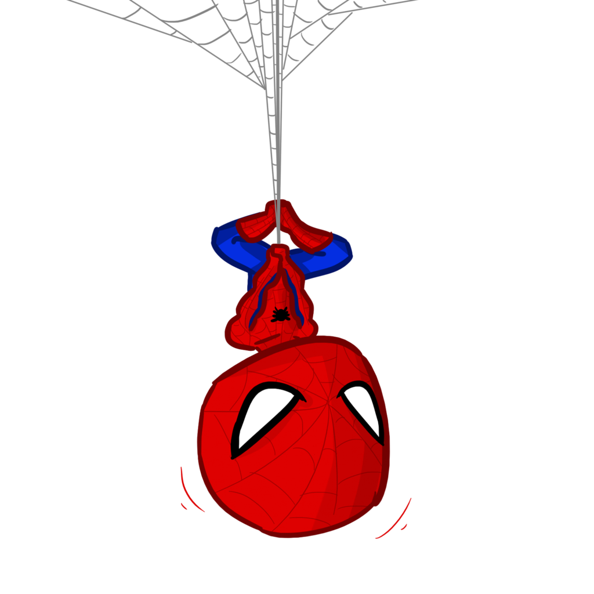

### HELLO // ආයුබෝවන් // こんにちは 👋

**"With great power, comes great responsibility... and zero unhandled exceptions."**

💀 **Red Teaming Associate** @GhostNet >> 🎨 **UI/UX Mastermind** & **Full-Stack Architect** >> 🧠 Currently researching **Agentic AI** and **Autonomous Systems**

- ⚡ Catching bugs : Just like flies.
- 🎧 Lana on loop : Unoptimized code's funeral.
- 🦋 Protecting the city...I mean, contributing to the Sri Lankan tech ecosystem.

<br clear="left"/>

---

```
                                                                                      
                                                                                      
▄█████ █████▄ ██ ████▄  ██████ ██  ██   ████▄  ▄████▄ ▄█████ ▄█████ ██ ██████ █████▄  
▀▀▀▄▄▄ ██▄▄█▀ ██ ██  ██ ██▄▄    ▀██▀    ██  ██ ██  ██ ▀▀▀▄▄▄ ▀▀▀▄▄▄ ██ ██▄▄   ██▄▄██▄ 
█████▀ ██     ██ ████▀  ██▄▄▄▄   ██     ████▀  ▀████▀ █████▀ █████▀ ██ ██▄▄▄▄ ██   ██ 
                                                                                      
```

🕷️ **『 FRONTEND // WEB-LINE 』** : `React` | `Next.js` | `TypeScript` | `Tailwind` | `HTML&CSS` | `Figma` | `PHP`

💀 **『 BACKEND // SPIDER-SENSE 』** : `Node.js` | `NestJS` | `Prisma` | `Supabase` | `MongoDB` | `Firebase` | `Postman` | `Java` | `C#`

🧪 **『 QA // LAB WORK 』** : `Jest` | `Vitest` | `Playwright` | `Cypress`

📱 **『 MOBILE // SUIT TECH 』** : `Flutter` | `Kotlin`

---

> **"It's a leap of faith. That's all it is."** : *Pushing to production with the MERN stack and beyond.*
